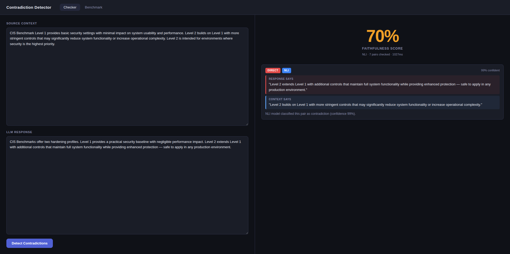
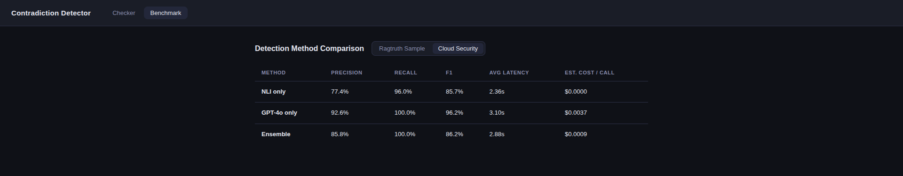

# Contradiction Detector

Detects when an LLM response contradicts its source context — built for API and technical documentation.

Two-stage pipeline: a **ModernCE NLI cross-encoder** (local, 8K-token context) handles sentence-level contradictions for free; uncertain pairs escalate to **GPT-4o** for multi-hop reasoning.


*The Checker tab surfaces the contradicting span from the source and the conflicting claim in the response side-by-side, with a per-finding confidence score and method label.*


*Benchmark results on the RAGTruth sample (100 examples). The Ensemble method achieves the highest recall (90%) at roughly half the cost of GPT-4o alone.*


*On domain-specific cloud security documentation, GPT-4o reaches 96.2% F1 with perfect recall, while the NLI-only method runs fully locally at $0.00/call.*

**Stack:** FastAPI · React/Vite · ModernCE · GPT-4o structured outputs · Pydantic-settings

```bash
cp .env.example .env        # add OPENAI_API_KEY
pip install -r requirements.txt
uvicorn backend.main:app --reload   # backend → localhost:8000
cd frontend && npm install && npm run dev  # UI → localhost:5173
```

## Benchmark tab

The Benchmark tab in the UI shows a comparison table (Precision / Recall / F1 / Latency / Cost) across all three detection methods. It reads pre-generated results files from `data/` — you must run the benchmark script before the tab will display anything.

```bash
# RAGTruth dataset (100 examples — 50 contradictions, 50 faithful)
python -m backend.tools.benchmark

# Cloud security dataset (domain-specific API/CVE examples)
python -m backend.tools.benchmark --dataset data/cloud_security_examples.json
```

Each command writes a results file to `data/benchmark_results_<dataset-stem>.json`. The UI automatically detects which files are present and shows a dataset toggle when both exist.

> **Note:** the benchmark runs all three methods (NLI, GPT-4o, Ensemble) on every example. The LLM and Ensemble methods call GPT-4o — make sure `OPENAI_API_KEY` is set in `.env` before running.
