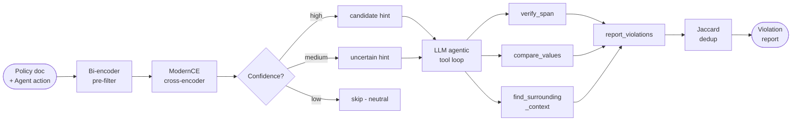

# Policy Guard

**[Live Demo →](https://policy-guard.vercel.app)**

AI agents reasoning autonomously can violate your documented policies - even when those policies are right there in the system prompt. Policy Guard reads the actual policy document and flags violations in the agent's planned actions before they execute, without requiring you to manually encode any rules.

Paste a policy document (API spec, access rules, security runbook) and an agent's planned action. The system returns a compliance score, the exact violating spans, and the confidence level - in under a second for NLI-only, a few seconds for LLM-backed analysis.


https://github.com/user-attachments/assets/a4ede677-c817-445a-8cae-99674edb65b6

---

## How it works



**NLI (local, free)** - a bi-encoder pre-filter narrows the sentence-pair search space from O(M*N) to top-K candidates, then ModernCE cross-encoder (8,192-token context) scores each pair. High-confidence contradictions surface as candidate hints; uncertain pairs are escalated. Purely neutral documents skip the LLM entirely.

**LLM judge (gpt-5.4-mini or Claude)** - runs an agentic tool loop with three deterministic tools before committing to any finding: `verify_span` (prevents hallucinated evidence), `compare_values` (exact numeric comparison for versions, CVSS scores, rate limits), and `find_surrounding_context` (catches negation and conditional scoping). The model is forced to call `report_violations` as structured output. Multi-hop violations - where no single sentence pair crosses the threshold - are caught here.

NLI's role is pre-filtering: narrowing the pairs worth examining, and providing focused hints to the LLM. It never bypasses review or gates final output directly.

**Compliance scoring** uses a confidence-weighted survival product: `score = ∏(1 − severity_weight × confidence)` over all detected violations. Unlike a simple additive penalty, the product formula is probabilistically grounded — it models P(action is compliant) as the joint probability that no violation independently blocks execution, assuming independence (guaranteed by Jaccard deduplication). Violations with lower model confidence contribute proportionally less; a certain BLOCKING violation (weight 1.0, confidence 1.0) naturally produces a score of 0.0 without any special-case logic, while the same violation at 90% confidence yields 0.10 rather than an arbitrary hard fail. Severity labels are operational — BLOCKING (single-rule, execution-stopping), WARNING (partial or conditional restriction), and INFERRED (derived by reasoning across multiple policy rules) — not internal NLI jargon.

---

## Stack

| Layer | Technology |
|---|---|
| Backend | FastAPI, pydantic-settings |
| NLI pipeline | ModernCE cross-encoder, BAAI/bge-small-en-v1.5 bi-encoder |
| LLM judge | gpt-5.4-mini / Claude (switchable via env var) |
| Persistence | MongoDB, Motor async driver, TTL index, aggregation pipeline |
| Integration | LangChain callback (`FaithfulnessGuard`) |
| Frontend | React, Vite |
| Deployment | Backend on Hugging Face Spaces (Docker), frontend on Vercel |

---

## Quickstart

```bash
cp .env.example .env        # add OPENAI_API_KEY (or ANTHROPIC_API_KEY + LLM_PROVIDER=claude)
pip install -r requirements.txt
uvicorn backend.main:app --reload      # backend -> localhost:8000
cd frontend && npm install && npm run dev   # UI -> localhost:5173
```

MongoDB is optional - if `MONGODB_URL` is not set, the app runs without history persistence.

Switch LLM providers with one env var, no code changes:

```bash
LLM_PROVIDER=claude
ANTHROPIC_API_KEY=sk-ant-...
```

---

## Integrating into an agentic system

Policy Guard exposes a single HTTP endpoint - any agent framework or language can call it:

```http
POST /check
Content-Type: application/json

{
  "context": "<your full policy document>",
  "response": "<agent's planned action or final answer>"
}
```

The response includes a `compliance_score` (0-1), a list of `violations` with exact spans and confidence scores, and the detection method used (`NLI`, `LLM`, or `Ensemble`).

**End-to-end example:** [policy-guard-langchain-demo](https://github.com/talalter/policy-guard-langchain-demo) is a LangChain ReAct agent wired to a hybrid BM25 + dense retrieval pipeline. Policy Guard is plugged in as a callback - 30 lines, no library import, just HTTP:

```python
class PolicyGuard(BaseCallbackHandler):
    def on_chain_end(self, outputs, **kwargs):
        policy = Path("data/policy.txt").read_text()
        response = outputs.get("output", "")
        report = httpx.post("http://localhost:8000/check",
                            json={"context": policy, "response": response}).json()
        # report["faithfulness_score"], report["contradictions"]
```


The policy document is always loaded in full - not as retrieved chunks - so no rule can be silently missed by a retrieval gap. The demo runs adversarial questions designed to elicit policy violations and shows the guard catching each one.

For LangChain projects, the built-in `FaithfulnessGuard` callback runs the full pipeline inline:

```python
from backend.integrations import FaithfulnessGuard
from backend.core import Router

guard = FaithfulnessGuard(router=Router())
executor = AgentExecutor(agent=..., tools=[...], callbacks=[guard])
```

Pass `raise_on_contradiction=True` to raise `FaithfulnessViolationError` instead of logging - useful in CI pipelines or strict agentic workflows.

---

## Persistence and observability

Every detection run is persisted to MongoDB via Motor (async driver), storing the full policy document, agent action, violations, score, and timestamp - enough to reproduce any finding without re-running the model. A session-scoped aggregation pipeline computes live stats in a single round-trip: total runs, total violations, and a **confirmed-by-feedback rate** that tracks real-world precision over time.

Each violation card has a thumb-up / thumb-down button - verdicts are stored in a separate `feedback` collection and are idempotent at the `(run_id, violation_index)` level, so retries never inflate the numbers. A TTL index automatically expires old runs, keeping storage bounded without any maintenance job.

---

## Benchmark

Evaluated on `agent_action_policy_benchmark_v1` - a purpose-built dataset of agent actions at three difficulty levels (easy / medium / hard), balanced across violation and compliant examples.

| Method | Precision | Recall | F1 | AUC-ROC | FPR | Latency | Cost/call |
|---|---|---|---|---|---|---|---|
| NLI only | 45.5% | 62.5% | 52.6% | 0.458 | 75.0% | 2.5s | $0.00 |
| gpt-5.4-mini only | **94.1%** | **100%** | **97.0%** | **0.995** | **6.3%** | 4.4s | $0.007 |
| Ensemble | 80.7% | 78.1% | 79.4% | 0.841 | 18.8% | 7.2s | $0.004 |

F1 95% CI (bootstrap, 1000 resamples): NLI `[0.39, 0.66]` - LLM `[0.92, 1.00]` - Ensemble `[0.67, 0.89]`

**Per-difficulty F1:**

| Method | Easy | Medium | Hard |
|---|---|---|---|
| NLI only | 0.67 | 0.38 | 0.54 |
| gpt-5.4-mini only | **0.95** | **0.96** | **1.00** |
| Ensemble | 0.90 | 0.67 | 0.82 |

**Why the ensemble underperforms LLM-only:** the NLI pre-filter currently runs `ModernCE-base`, whose AUC-ROC of 0.46 on this dataset is essentially a coin flip. Instead of narrowing the LLM's search space, it introduces noise into the hint set - which explains why the ensemble adds 2.8s of latency and still lands 17.6 F1 points below the LLM alone. The planned upgrade to `ModernCE-large` targets this directly; because the pre-filter and judge are architecturally separated, the swap is a single config line.

**LLM-only is the production-recommended method** - 100% recall, 94.1% precision, 6.3% false positive rate, at ~$0.007 per call.

```bash
python -m backend.tools.benchmark
```
