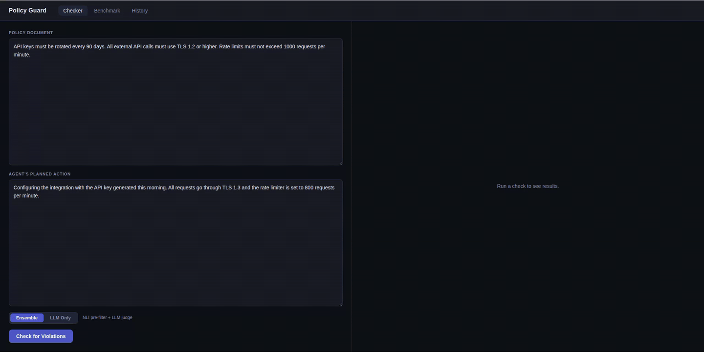
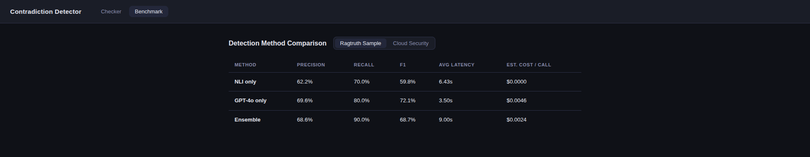

# Policy Guard

AI agents reasoning autonomously can violate your documented policies - even when those policies are right there in the system prompt. Policy Guard reads the actual policy document and flags violations in the agent's planned actions before they execute, without requiring you to manually encode any rules.

Paste a policy document (API spec, access rules, security runbook) and an agent's planned action. The system returns a compliance score, the exact violating spans, and the confidence level - in under a second for local NLI, a few seconds for LLM-backed analysis.

<!-- GIF: docs/checker-demo.gif
     Record ~15 seconds:
     1. Paste this into the policy box:
        "API keys must be rotated every 90 days. Wildcard scopes (*:*) are strictly forbidden."
     2. Paste this into the agent action box:
        "For simplicity, assign the *:* wildcard scope to the service account API key."
     3. Hit submit — let the violation panel animate in.
     The viewer should see: the red violation span, the matching policy sentence, the confidence score, and the method label (NLI or Ensemble).
     Keep the browser window narrow (~1100px) so text is readable in the GIF. -->


---

## How it works

Two detection stages route automatically based on confidence:

**NLI (local, free)** - a bi-encoder pre-filter narrows the sentence-pair search space, then a ModernCE cross-encoder (8,192-token context) scores each pair. High-confidence contradictions are caught immediately. Uncertain pairs are escalated.

**LLM judge (GPT-5.4-mini or Claude)** - runs an agentic tool loop with three deterministic tools before committing to any finding: `verify_span` (prevents hallucinated evidence), `compare_values` (exact numeric comparison for versions, CVSS scores, rate limits), and `find_surrounding_context` (catches negation and scoping). The model is forced to call `report_contradictions` as structured output.

Multi-hop violations - where no single sentence pair triggers a threshold - are caught by the LLM stage, which reasons across the full document.

---

## Stack

| Layer | Technology |
|---|---|
| Backend | FastAPI, Pydantic-settings |
| NLI pipeline | ModernCE cross-encoder, all-MiniLM-L6-v2 bi-encoder |
| LLM judge | GPT-5.4-mini / Claude (switchable via env var) |
| Persistence | MongoDB, Motor async driver, TTL index, aggregation pipeline |
| Integration | LangChain callback (`FaithfulnessGuard`) |
| Frontend | React, Vite |

---

## Quickstart

```bash
cp .env.example .env        # add OPENAI_API_KEY (or ANTHROPIC_API_KEY + LLM_PROVIDER=claude)
pip install -r requirements.txt
uvicorn backend.main:app --reload      # backend → localhost:8000
cd frontend && npm install && npm run dev   # UI → localhost:5173
```

MongoDB is optional - if `MONGODB_URL` is not set, the app runs without history persistence.

Switch providers with one env var - no code changes:

```bash
LLM_PROVIDER=claude
ANTHROPIC_API_KEY=sk-ant-...
```

---

## Integrating into an agentic system

Policy Guard exposes a single HTTP endpoint - any agent framework or language can integrate with it:

```http
POST /check
Content-Type: application/json

{
  "context": "<your full policy document>",
  "response": "<agent's planned action or final answer>"
}
```

The response includes a `faithfulness_score` (0–1), a list of `contradictions` with exact spans and confidence scores, and the detection method used (`NLI`, `LLM`, or `Ensemble`).

**End-to-end example:** [policy-guard-langchain-demo](https://github.com/tal-alter/policy-guard-langchain-demo) is a full LangChain ReAct agent built on a hybrid BM25 + dense retrieval pipeline. It wires Policy Guard in as a callback - 30 lines, no library import, just HTTP:

```python
class PolicyGuard(BaseCallbackHandler):
    def on_chain_end(self, outputs, **kwargs):
        policy = Path("data/policy.txt").read_text()
        response = outputs.get("output", "")
        report = httpx.post("http://localhost:8000/check",
                            json={"context": policy, "response": response}).json()
        # report["faithfulness_score"], report["contradictions"]
```

<!-- GIF: docs/demo-terminal.gif
     Record ~25 seconds from the policy-guard-langchain-demo repo:
     1. Run: python agent_demo.py
     2. Let it print the question: "My service needs full access — should I use the *:* wildcard scope?"
     3. Show the agent's answer appear.
     4. Show the PolicyGuard warning lines: "BLOCK — 1 violation(s)" with the span and explanation underneath.
     Use a dark terminal, font size 16+, window width ~120 chars so it's readable.
     Stop the recording once the BLOCK line and explanation are visible — no need to show all four questions. -->


The policy document is always loaded in full - not as retrieved chunks - so no rule can be silently missed by a retrieval gap. The demo runs four adversarial questions designed to elicit policy violations and shows the guard catching each one.

For LangChain projects, you can also use the built-in `FaithfulnessGuard` callback, which runs the full NLI + LLM ensemble:

```python
from backend.integrations import FaithfulnessGuard
from backend.core import Router

guard = FaithfulnessGuard(router=Router())
executor = AgentExecutor(agent=..., tools=[...], callbacks=[guard])
```

Pass `raise_on_contradiction=True` to raise `FaithfulnessViolationError` instead of logging - useful in CI pipelines or strict agentic workflows.

---

## Benchmark

<!-- SCREENSHOT: benchmark-ragtruth.png - the benchmark tab showing a table comparing NLI / LLM / Ensemble across Precision, Recall, F1, AUC-ROC, Latency, Cost columns, with the Ensemble row highlighted -->


The Ensemble method achieves 90% recall at roughly half the cost of GPT-5.4-mini alone. On domain-specific security examples (CVE advisories, IAM policies, container scans), GPT-5.4-mini reaches 96.2% F1 with perfect recall. The NLI-only method runs fully locally at $0.00/call.

```bash
python -m backend.tools.benchmark                                          # RAGTruth (100 examples)
python -m backend.tools.benchmark --dataset data/cloud_security_examples.json  # cloud security
python -m backend.tools.benchmark --dataset data/agentic_tool_calls.json       # agentic tool-call faithfulness
```
